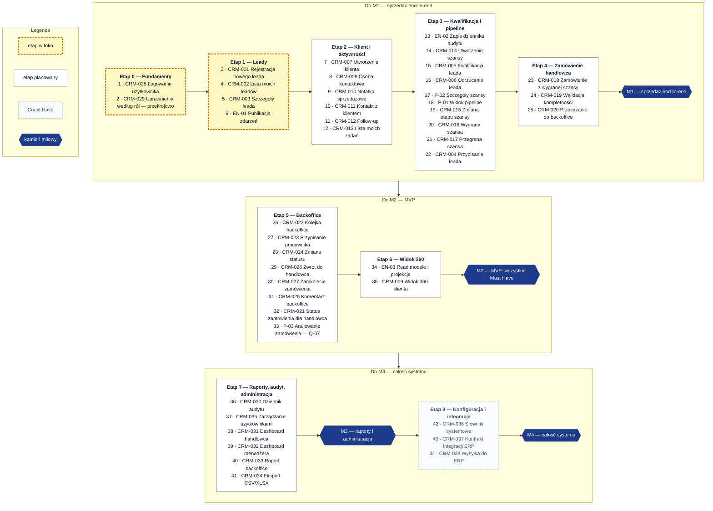

# Plan realizacji — kolejność PBI

Kolejność realizacji wszystkich PBI potrzebnych do zbudowania całego systemu CRM: 38 story z backlogu
([03-backlog-user-stories.md](03-backlog-user-stories.md)), enablery techniczne (`EN-xx`) i propozycje uzupełnień backlogu (`P-xx`).
Stan na 2026-09-26 (gałąź `main` po PR #4).

Źródła kolejności: zależności modelu domeny ([pakiet DDD](crm_ddd_ai_agent_package/README.md)), sekcja „Implementation order”
w `.github/copilot-instructions.md`, priorytety backlogu i otwarte pytania
([open_questions.md](crm_ddd_ai_agent_package/ai_readable/open_questions.md)).

## Zasady ustalania kolejności

1. **Zależności domenowe** — np. szansa wymaga klienta (Q-01), zamówienie wymaga wygranej szansy, obsługa backoffice
   wymaga przekazanego zamówienia, widok 360 wymaga danych ze wszystkich kontekstów sprzedaży.
2. **Pionowe wycinki** w kolejności z `.github/copilot-instructions.md`: lead → szczegóły → notatki i kontakty →
   kwalifikacja → pipeline → wygrana/przegrana → zamówienie → backoffice → zwrot → zamknięcie → raporty → integracje.
3. **Priorytety** — Must Have przed Should Have i Could Have; PBI nie może zależeć od PBI o niższym priorytecie.
   Should Have, które domykają przepływ (np. odrzucenie leada przy kwalifikacji), są realizowane „po drodze”
   i można je przesunąć bez łamania zależności.
4. **Enablery techniczne** — bezpośrednio przed pierwszym PBI, które ich potrzebuje.
5. **Gotowość** — PBI z otwartym pytaniem `Q-xx` wchodzi do realizacji dopiero po decyzji albo po akceptacji
   założenia roboczego z `open_questions.md`.

## Kamienie milowe

| Kamień | Po etapie | Co działa |
|---|---|---|
| M1 — sprzedaż end-to-end | 4 | lead → klient → szansa → wygrana → zamówienie przekazane do backoffice |
| M2 — MVP | 6 | wszystkie Must Have: obsługa zamówienia w backoffice do zamknięcia, zwroty do handlowca, widok 360 klienta, uprawnienia zgodne z macierzą |
| M3 — raporty i administracja | 7 | dashboardy, raport backoffice, eksport, dziennik audytu, zarządzanie użytkownikami |
| M4 — całość systemu | 8 | konfigurowalne słowniki, integracja z ERP/fakturowaniem |

<!-- diagram: 10_delivery_plan -->

Plik PNG: [10_delivery_plan.png](crm_ddd_ai_agent_package/diagrams/png/10_delivery_plan.png).

## Kolejność PBI

Kolumny: **Typ** — `story` (backlog), `enabler` (techniczny, spoza backlogu), `propozycja` (luka w backlogu);
**Status** — ze story w backlogu (`doc/03`), dla `EN`/`P` — „Propozycja”; **Zależy od** — PBI, które muszą być
ukończone wcześniej; **Decyzje** — pytania biznesowe `Q-xx` i decyzje techniczne `T-xx`;
**Klienci** — W: web, M: mobile, —: tylko backend lub analiza.

### Etap 0 — Fundamenty (w toku)

| Kolejność | PBI | Nazwa | Typ | Priorytet | Status | Zależy od | Decyzje | Klienci |
|---|---|---|---|---|---|---|---|---|
| 1 | CRM-028 | Logowanie użytkownika | story | Must Have | Review | — | — | W, M |
| 2 | CRM-029 | Uprawnienia według ról | story | Must Have | In Progress | — | Q-12 | W, M |

- CRM-028: logowanie OIDC (SimpleIdServer) działa w web i mobile, API odrzuca żądania bez tokena — do akceptacji.
- CRM-029 jest przekrojowe: każde kolejne PBI dodaje swoje polityki (`CrmPolicies`) zgodnie z macierzą `doc/02` §3.
  Story zamyka weryfikacja polityk wszystkich funkcji MVP przy kamieniu M2.

### Etap 1 — Leady

| Kolejność | PBI | Nazwa | Typ | Priorytet | Status | Zależy od | Decyzje | Klienci |
|---|---|---|---|---|---|---|---|---|
| 3 | CRM-001 | Rejestracja nowego leada | story | Must Have | In Progress | CRM-028 | Q-02, Q-03, Q-16, T-07 | W, M |
| 4 | CRM-002 | Lista moich leadów | story | Must Have | In Progress | CRM-001 | Q-13 | W, M |
| 5 | CRM-003 | Szczegóły leada | story | Must Have | Backlog | CRM-002 | — | W, M |
| 6 | EN-01 | Publikacja zdarzeń domenowych i integracyjnych | enabler | Must Have | Propozycja | — | T-02 | — |

- CRM-001: działa `POST /api/leads` i formularz web. Do domknięcia: temat/nazwa leada, priorytet, reguła
  „telefon albo e-mail” (kod wymaga e-maila), ostrzeżenie o duplikacie (Q-02, Q-03), ekran rejestracji w mobile (Q-16),
  value objecty `EmailAddress` i `PhoneNumber` (T-07).
- CRM-002: działa `GET /api/leads/mine` i lista w web i mobile. Do domknięcia: temat, priorytet i klient na liście,
  filtrowanie po statusie, sortowanie po dacie i priorytecie, przejście do szczegółów.
- CRM-003: `GetLeadDetailsQuery`; historia aktywności pojawia się wraz z CRM-010 i CRM-011.
- EN-01 realizujemy wcześnie, bo z publikacji zdarzeń korzystają polityki (CRM-005), audyt (EN-02), przekazanie
  zamówienia (CRM-020) i projekcje (EN-03).

### Etap 2 — Klient i aktywności

| Kolejność | PBI | Nazwa | Typ | Priorytet | Status | Zależy od | Decyzje | Klienci |
|---|---|---|---|---|---|---|---|---|
| 7 | CRM-007 | Utworzenie klienta | story | Must Have | Backlog | CRM-028 | Q-01, Q-02, T-01, T-03 | W |
| 8 | CRM-008 | Dodanie osoby kontaktowej | story | Must Have | Backlog | CRM-007 | — | W |
| 9 | CRM-010 | Dodanie notatki sprzedażowej | story | Must Have | Backlog | CRM-003 | Q-17, T-04 | W, M |
| 10 | CRM-011 | Zarejestrowanie kontaktu z klientem | story | Must Have | Backlog | CRM-010 | T-04 | W, M |
| 11 | CRM-012 | Zaplanowanie follow-upu | story | Must Have | Backlog | CRM-010 | — | W, M |
| 12 | CRM-013 | Lista moich zadań | story | Must Have | Backlog | CRM-012 | Q-16 | W, M |

- CRM-007 otwiera nowy kontekst (Customer Management) — przed startem decyzje T-01 (układ folderów) i T-03 (typy identyfikatorów).
- CRM-010–013 budują jeden agregat `SalesActivity` (T-04); pierwsza story tworzy agregat, kolejne dodają typy aktywności.
- W mobile: notatka, kontakt i follow-up jako szybkie zadania handlowca (Q-16).

### Etap 3 — Kwalifikacja i pipeline

| Kolejność | PBI | Nazwa | Typ | Priorytet | Status | Zależy od | Decyzje | Klienci |
|---|---|---|---|---|---|---|---|---|
| 13 | EN-02 | Zapis dziennika audytu | enabler | Should Have | Propozycja | EN-01 | T-05 | — |
| 14 | CRM-014 | Utworzenie szansy sprzedaży | story | Must Have | Backlog | CRM-003, CRM-007 | Q-01, Q-19 | W |
| 15 | CRM-005 | Kwalifikacja leada | story | Must Have | Backlog | CRM-014, EN-01 | Q-01 | W |
| 16 | CRM-006 | Odrzucenie leada | story | Should Have | Backlog | CRM-003, EN-02 | — | W, M |
| 17 | P-02 | Szczegóły szansy sprzedaży | propozycja | Must Have | Propozycja | CRM-014 | — | W |
| 18 | P-01 | Widok pipeline szans | propozycja | Must Have | Propozycja | CRM-014 | Q-13 | W |
| 19 | CRM-015 | Zmiana etapu szansy sprzedaży | story | Must Have | Backlog | P-02 | Q-19 | W |
| 20 | CRM-016 | Oznaczenie szansy jako wygranej | story | Must Have | Backlog | CRM-015 | Q-18 | W |
| 21 | CRM-017 | Oznaczenie szansy jako przegranej | story | Should Have | Backlog | CRM-015 | — | W |
| 22 | CRM-004 | Przypisanie leada do handlowca | story | Should Have | Backlog | CRM-002, EN-02 | Q-13 | W |

- EN-02 przed pierwszym zdarzeniem audytowanym (`LeadRejected`, `LeadAssigned`, `OpportunityStageChanged`) — zdarzenia
  sprzed wdrożenia audytu nie trafią do dziennika.
- CRM-014 i CRM-005: kwalifikacja tworzy szansę polityką `LeadQualified` → `CreateOpportunityFromLead`; szansa wymaga
  klienta (Q-01). Metody `Lead.Qualify()` i `Lead.Reject(reason)` już istnieją w domenie — brakuje handlerów, API i UI.
- Po wygranej zamówienie tworzy handlowiec (Etap 4) — nie powstaje automatycznie.

### Etap 4 — Zamówienie handlowca → M1

| Kolejność | PBI | Nazwa | Typ | Priorytet | Status | Zależy od | Decyzje | Klienci |
|---|---|---|---|---|---|---|---|---|
| 23 | CRM-018 | Utworzenie zamówienia z wygranej szansy | story | Must Have | Backlog | CRM-016, CRM-007 | Q-04, Q-05 | W |
| 24 | CRM-019 | Walidacja kompletności zamówienia | story | Must Have | Backlog | CRM-018 | Q-05 | W |
| 25 | CRM-020 | Przekazanie zamówienia do backoffice | story | Must Have | Backlog | CRM-019, EN-01 | Q-08 | W |

- CRM-018: snapshot klienta (`OrderCustomerSnapshot`), status `Draft`, zapis bez przekazania.
- CRM-020 publikuje `SalesOrderSubmittedIntegrationEvent` i otwiera sprawę backoffice (`OpenBackofficeOrderCase`);
  kryterium „backoffice widzi zamówienie na kolejce” domyka CRM-022.

### Etap 5 — Backoffice

| Kolejność | PBI | Nazwa | Typ | Priorytet | Status | Zależy od | Decyzje | Klienci |
|---|---|---|---|---|---|---|---|---|
| 26 | CRM-022 | Kolejka nowych zamówień backoffice | story | Must Have | Backlog | CRM-020 | — | W |
| 27 | CRM-023 | Przypisanie zamówienia do pracownika backoffice | story | Must Have | Backlog | CRM-022 | — | W |
| 28 | CRM-024 | Zmiana statusu zamówienia przez backoffice | story | Must Have | Backlog | CRM-023 | Q-06, Q-14 | W |
| 29 | CRM-026 | Zwrot zamówienia do handlowca | story | Must Have | Backlog | CRM-024 | Q-08, Q-09 | W |
| 30 | CRM-027 | Zamknięcie zamówienia jako zrealizowanego | story | Must Have | Backlog | CRM-024 | — | W |
| 31 | CRM-025 | Dodanie komentarza backoffice | story | Should Have | Backlog | CRM-022 | — | W |
| 32 | CRM-021 | Podgląd statusu zamówienia przez handlowca | story | Should Have | Backlog | CRM-024, CRM-025, CRM-026 | Q-16 | W, M |
| 33 | P-03 | Anulowanie zamówienia | propozycja | do decyzji | Propozycja | CRM-024 | Q-07 | W |

- CRM-024: workflow statusów według propozycji z [order_status_lifecycle.md](crm_ddd_ai_agent_package/ai_readable/order_status_lifecycle.md) (Q-06); blokada wymaga powodu.
- CRM-026 zamyka pętlę z CRM-020: zwrot z komentarzem, poprawa i ponowne przekazanie (Q-08); automatyczny follow-up tylko po decyzji Q-09.
- P-03 tylko po decyzji Q-07 — do tego czasu status „Anulowane” nie jest używany.

### Etap 6 — Widok 360 → M2 (MVP)

| Kolejność | PBI | Nazwa | Typ | Priorytet | Status | Zależy od | Decyzje | Klienci |
|---|---|---|---|---|---|---|---|---|
| 34 | EN-03 | Read modele i projekcje | enabler | Must Have | Propozycja | EN-01 | T-06 | — |
| 35 | CRM-009 | Widok 360 klienta | story | Must Have | Backlog | CRM-008, CRM-011, CRM-014, CRM-018, EN-03 | — | W |

- CRM-009 łączy leady, szanse, kontakty, notatki i zamówienia klienta, dlatego jest po Etapie 5; można go dostarczać
  przyrostowo od Etapu 2, ale jest ukończony dopiero z zamówieniami.
- Po etapie: zamknięcie CRM-029 (polityki wszystkich funkcji MVP) → kamień **M2 — MVP**.

### Etap 7 — Raporty, audyt i administracja → M3

| Kolejność | PBI | Nazwa | Typ | Priorytet | Status | Zależy od | Decyzje | Klienci |
|---|---|---|---|---|---|---|---|---|
| 36 | CRM-030 | Dziennik audytu | story | Should Have | Backlog | EN-02 | T-05 | W |
| 37 | CRM-035 | Zarządzanie użytkownikami | story | Should Have | Backlog | CRM-028 | Q-12 | W |
| 38 | CRM-031 | Dashboard handlowca | story | Should Have | Backlog | CRM-013, CRM-014, CRM-026, EN-03 | Q-15 | W |
| 39 | CRM-032 | Dashboard menedżera sprzedaży | story | Should Have | Backlog | CRM-011, CRM-017, EN-03 | Q-13, Q-15 | W |
| 40 | CRM-033 | Raport backoffice | story | Should Have | Backlog | CRM-027, EN-03 | Q-15 | W |
| 41 | CRM-034 | Eksport raportów do CSV/XLSX | story | Could Have | Backlog | CRM-032, CRM-033 | — | W |

- CRM-030 pokazuje wpisy zapisywane od Etapu 3 (EN-02).
- CRM-035: zarządzanie kontami w panelu SSO albo w CRM (Q-12); przy wariancie z panelem SSO story sprowadza się do procedury i uprawnień.

### Etap 8 — Konfiguracja i integracje → M4

| Kolejność | PBI | Nazwa | Typ | Priorytet | Status | Zależy od | Decyzje | Klienci |
|---|---|---|---|---|---|---|---|---|
| 42 | CRM-036 | Konfiguracja słowników systemowych | story | Could Have | Backlog | CRM-001, CRM-015 | Q-19 | W |
| 43 | CRM-037 | Definicja kontraktu integracji ERP/fakturowanie | story | Could Have | Backlog | CRM-027 | Q-10, Q-11 | — |
| 44 | CRM-038 | Wysłanie zamówienia do ERP/fakturowania | story | Could Have | Backlog | CRM-037, EN-01 | Q-10 | W |

- CRM-036 zastępuje stałe wartości (źródła leadów, priorytety, powody przegranej, etapy pipeline) słownikami (Q-19).
- CRM-038: warstwa antykorupcyjna, zadanie integracji z ograniczonym ponawianiem i błędem widocznym dla uprawnionych (proces 6 pakietu DDD).

## Enablery techniczne

| ID | Nazwa | Zakres | Decyzja | Potrzebny dla |
|---|---|---|---|---|
| EN-01 | Publikacja zdarzeń domenowych i integracyjnych | dispatcher zdarzeń po zapisie (`SaveChanges`), broker in-memory za abstrakcją, publikacja zdarzeń integracyjnych przez warstwę aplikacji, identyfikatory korelacji i przyczynowości; później outbox i RabbitMQ | T-02 | CRM-005, CRM-020, EN-02, EN-03, CRM-038 |
| EN-02 | Zapis dziennika audytu | subskrypcja zdarzeń audytowanych (katalog zdarzeń), wpis: użytkownik, czas, akcja, identyfikator obiektu | T-05 | CRM-004, CRM-006, CRM-030 i wszystkie zdarzenia audytowane |
| EN-03 | Read modele i projekcje | projekcje ze zdarzeń dla widoków łączących moduły | T-06 | CRM-009, CRM-031, CRM-032, CRM-033 |

## Propozycje nowych PBI (luki w backlogu)

| ID | Nazwa | Uzasadnienie | Proponowany priorytet |
|---|---|---|---|
| P-01 | Widok pipeline szans | ekran „Opportunity Pipeline” z `.github/copilot-instructions.md`, zapytanie `GetOpportunityPipelineQuery`, uprawnienia „Podgląd pipeline własnego / zespołu” (`doc/02` §3) — brak osobnej story | Must Have |
| P-02 | Szczegóły szansy sprzedaży | CRM-015 wymaga, by etap był widoczny „na szczegółach szansy”, a historia etapów w szczegółach — brak story ze szczegółami | Must Have |
| P-03 | Anulowanie zamówienia | status „Anulowane” w słowniku (§6.3), komenda `CancelOrder` w modelu; wymaga decyzji Q-07 | do decyzji |

Po akceptacji dopisz je do backlogu jako kolejne story (CRM-039 i dalej) i zamień identyfikatory w tym planie.

## Decyzje wymagane przed etapami

| Etap | Pytania biznesowe | Decyzje techniczne |
|---|---|---|
| 1 — Leady | Q-02, Q-03, Q-16 | T-02 (EN-01), T-07 |
| 2 — Klient i aktywności | Q-01, Q-02, Q-17 | T-01, T-03, T-04 |
| 3 — Kwalifikacja i pipeline | Q-01, Q-13, Q-18, Q-19 | T-05 (EN-02) |
| 4 — Zamówienie handlowca | Q-04, Q-05, Q-08 | — |
| 5 — Backoffice | Q-06, Q-07, Q-08, Q-09, Q-14 | — |
| 6 — Widok 360 | — | T-06 (EN-03) |
| 7 — Raporty, audyt, administracja | Q-12, Q-13, Q-15 | T-05 |
| 8 — Konfiguracja i integracje | Q-10, Q-11, Q-19 | — |

## Definicja gotowości i ukończenia

**Gotowe do realizacji (DoR):** wszystkie PBI z kolumny „Zależy od” są ukończone; pytania `Q-xx` z kolumny „Decyzje”
są rozstrzygnięte albo zaakceptowano założenie robocze; kryteria akceptacji w backlogu są aktualne.

**Ukończone (DoD)** — pionowy wycinek zgodnie z `.github/copilot-instructions.md`:

- domena, handler, kontrakt API i polityka autoryzacji zgodna z macierzą `doc/02` §3,
- migracja EF Core, jeśli zmienia się schemat (stosowana jawnie),
- testy TUnit + NSubstitute: domena, handler, test integracyjny endpointu (sukces, walidacja, autoryzacja),
- zmiany w kliencie web i/lub mobile według kolumny „Klienci”,
- zdarzenia audytowane trafiają do dziennika (po EN-02),
- aktualny status story w `doc/03`, w tym planie i stan implementacji w pakiecie DDD (`.md` + `.json`),
- `doc/crm_ddd_ai_agent_package/tools/validate-docs.ps1` bez błędów.

## Utrzymanie planu

- Po zmianie statusu story w `doc/03` zaktualizuj kolumnę „Status” w tym pliku.
- Nowe PBI wstawiaj za wszystkimi swoimi zależnościami i przenumeruj kolumnę „Kolejność”.
- `validate-docs.ps1` sprawdza: każdą story z backlogu dokładnie raz, zgodność nazw, priorytetów i statusów z backlogiem,
  ciągłą numerację, zależności wyłącznie od PBI wcześniejszych i o nie niższym priorytecie oraz opis każdego `EN` i `P`.
- Diagram etapów aktualizuje `tools/render-diagrams.ps1` (źródło: blok Mermaid w tym pliku).

