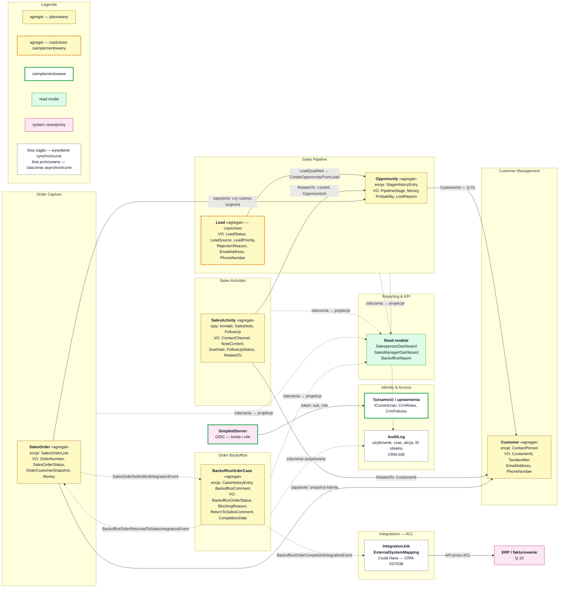

# Mapa kontekstów

Relacje między bounded contextami, właściciele agregatów i sposób komunikacji. Szczegóły agregatów:
[`bounded_contexts_and_aggregates.md`](bounded_contexts_and_aggregates.md), zasady komunikacji:
[`communication_rules.md`](communication_rules.md).

<!-- diagram: 01_context_map_with_entities_value_objects -->

Plik PNG: [`diagrams/png/01_context_map_with_entities_value_objects.png`](../diagrams/png/01_context_map_with_entities_value_objects.png).

## Relacje

| Dostawca (upstream) | Odbiorca (downstream) | Typ relacji | Mechanizm |
|---|---|---|---|
| Identity & Access (SimpleIdServer) | wszystkie konteksty | Open Host Service, odbiorcy przyjmują model tokena (Conformist) | token OIDC (`sub`, `role`), `ICurrentUser`, polityki `CrmPolicies` |
| Customer Management | Sales Pipeline | Customer / Supplier | `CustomerId` w `Opportunity` (Q-01) |
| Customer Management | Order Capture | Customer / Supplier | zapytanie o snapshot klienta → `OrderCustomerSnapshot` |
| Customer Management, Sales Pipeline | Sales Activities | Conformist | `RelatedTo` — identyfikator klienta, leada albo szansy |
| Sales Pipeline | Order Capture | Customer / Supplier | zapytanie: czy szansa jest wygrana, dane szansy |
| Order Capture | Order Backoffice | Customer / Supplier | `SalesOrderSubmittedIntegrationEvent` |
| Order Backoffice | Order Capture | Customer / Supplier | `BackofficeOrderReturnedToSalesIntegrationEvent` |
| Order Backoffice | Integrations | Customer / Supplier | `BackofficeOrderCompletedIntegrationEvent` (Q-10) |
| Integrations | ERP / fakturowanie | Anti-Corruption Layer | API systemu zewnętrznego; DTO nie trafiają do domeny |
| konteksty biznesowe | Reporting & KPI | Published Language | zdarzenia → projekcje (T-02, T-06) |
| konteksty biznesowe | Identity & Access (`AuditLog`) | Published Language | zdarzenia audytowane (T-05) |

## Granice, których nie wolno przekraczać

- Sprzedaż nie zmienia statusu realizacji, a backoffice nie zmienia pipeline sprzedaży:
  `Lead`, `Opportunity`, kontakt, oferta ≠ weryfikacja, przydział, braki, realizacja, zamknięcie.
- `Order Backoffice` nie modyfikuje `SalesOrder` — zwraca zamówienie zdarzeniem, a zmianę wykonuje `Order Capture`.
- `Reporting & KPI` nie wywołuje komend.

