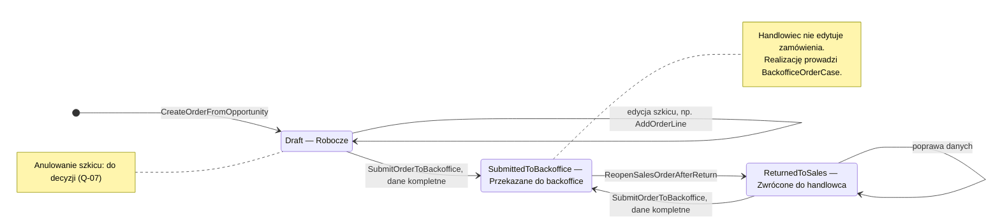
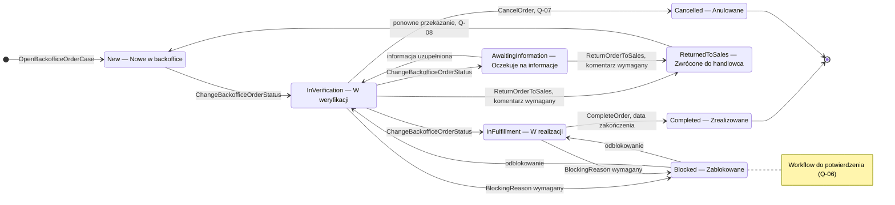

# Statusy zamówienia: `SalesOrder` i `BackofficeOrderCase`

Zamówienie ma dwa niezależne cykle życia z dwoma właścicielami: `SalesOrder` (Order Capture) opisuje, co sprzedał
handlowiec, a `BackofficeOrderCase` (Order Backoffice) — jak backoffice realizuje zamówienie. Status widoczny dla
użytkownika (`OrderStatus`, `GetSalesOrderStatusQuery`, CRM-021) łączy oba cykle w jednym widoku.

Workflow `BackofficeOrderCase` jest **propozycją do potwierdzenia** (Q-06). Stan implementacji: ○ planowane.

## Mapowanie na statusy ze słownika (`doc/01` §6.3)

| Status w słowniku | Właściciel | Identyfikator w kodzie |
|---|---|---|
| Robocze | `SalesOrder` | `Draft` |
| Przekazane do backoffice | `SalesOrder` | `SubmittedToBackoffice` |
| Nowe w backoffice | `BackofficeOrderCase` | `New` |
| W weryfikacji | `BackofficeOrderCase` | `InVerification` |
| W realizacji | `BackofficeOrderCase` | `InFulfillment` |
| Oczekuje na informacje | `BackofficeOrderCase` | `AwaitingInformation` |
| Zablokowane | `BackofficeOrderCase` | `Blocked` |
| Zwrócone do handlowca | `BackofficeOrderCase` i `SalesOrder` | `ReturnedToSales` |
| Zrealizowane | `BackofficeOrderCase` | `Completed` |
| Anulowane | `BackofficeOrderCase` | `Cancelled` (Q-07) |

## `SalesOrder`

<!-- diagram: 08_sales_order_lifecycle -->

Plik PNG: [`diagrams/png/08_sales_order_lifecycle.png`](../diagrams/png/08_sales_order_lifecycle.png).

Reguły: przekazać można tylko kompletne zamówienie (CRM-019, Q-05); po przekazaniu edycja jest zablokowana;
`ReopenSalesOrderAfterReturn` wykonuje polityka po `BackofficeOrderReturnedToSalesIntegrationEvent`.

## `BackofficeOrderCase`

<!-- diagram: 09_backoffice_order_case_lifecycle -->

Plik PNG: [`diagrams/png/09_backoffice_order_case_lifecycle.png`](../diagrams/png/09_backoffice_order_case_lifecycle.png).

| Przejście | Komenda | Wymagane dane | Zdarzenie |
|---|---|---|---|
| → `New` | `OpenBackofficeOrderCase` (polityka) | — | `BackofficeOrderCaseOpened` |
| `New` → `InVerification` → `InFulfillment`, `InVerification` ↔ `AwaitingInformation`, odblokowanie | `ChangeBackofficeOrderStatus` | status docelowy | `BackofficeOrderStatusChanged` |
| `InVerification` / `InFulfillment` → `Blocked` | `ChangeBackofficeOrderStatus` | `BlockingReason` | `BackofficeOrderBlocked` |
| `InVerification` / `AwaitingInformation` → `ReturnedToSales` | `ReturnOrderToSales` | komentarz | `BackofficeOrderReturnedToSales` |
| `ReturnedToSales` → `New` | `OpenBackofficeOrderCase` po ponownym przekazaniu | — | `BackofficeOrderCaseOpened` (Q-08) |
| `InFulfillment` → `Completed` | `CompleteOrder` | data zakończenia | `BackofficeOrderCompleted` |
| → `Cancelled` | `CancelOrder` | `CancellationReason` | `BackofficeOrderCancelled` (Q-07) |

Każde przejście zapisuje wpis w `CaseHistoryEntry`. Przejścia spoza tabeli są niedozwolone (`DomainException`).

