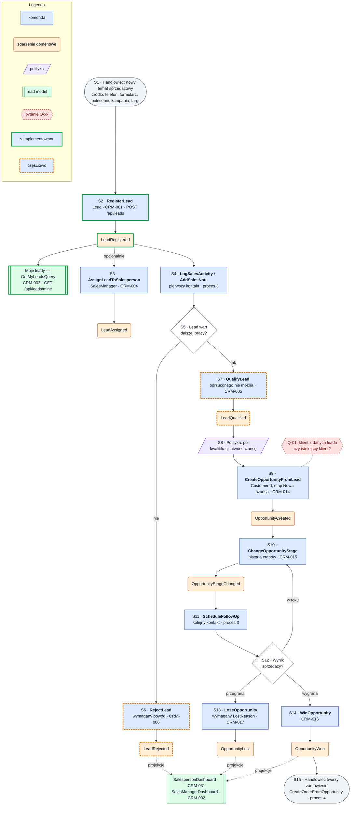

# Proces 1 — Obsługa leada i pipeline sprzedażowego

**Cel:** od nowego tematu sprzedażowego do wygranej lub przegranej szansy.
**Konteksty:** Sales Pipeline, Sales Activities, Customer Management, Reporting & KPI.
**Agregaty:** `Lead`, `Opportunity`, `SalesActivity`. **Backlog:** CRM-001, CRM-002, CRM-004–006, CRM-010–012, CRM-014–018.
Wersja maszynowa: [`processes.json`](processes.json) (`process_01_lead_pipeline`).

Oznaczenia: ✔ zaimplementowane, ◐ częściowo, ○ planowane, ❓ do decyzji.

## Kroki

| Krok | Typ | Opis | Kontekst / agregat | Komenda | Zdarzenia | Stan | Story |
|---|---|---|---|---|---|---|---|
| S1 | start | Handlowiec ma nowy temat sprzedażowy (źródło: telefon, formularz, polecenie, kampania, targi) | Sales Pipeline | — | — | — | — |
| S2 | komenda | Rejestracja leada z minimalnymi danymi klienta i osoby kontaktowej; właściciel z tokena | Sales Pipeline / `Lead` | `RegisterLead` | `LeadRegistered` | ✔ | CRM-001 |
| S3 | komenda | Opcjonalnie: menedżer zmienia właściciela leada | Sales Pipeline / `Lead` | `AssignLeadToSalesperson` | `LeadAssigned` | ○ | CRM-004 |
| S4 | komenda | Pierwszy kontakt i notatka ([proces 3](process_03_sales_activity.md)) | Sales Activities / `SalesActivity` | `LogSalesActivity`, `AddSalesNote` | `SalesActivityLogged`, `SalesNoteAdded` | ○ | CRM-010, CRM-011 |
| S5 | decyzja | Czy lead jest wart dalszej pracy? | — | — | — | — | — |
| S6 | komenda | Odrzucenie z podaniem powodu | Sales Pipeline / `Lead` | `RejectLead` | `LeadRejected` | ◐ | CRM-006 |
| S7 | komenda | Kwalifikacja leada (odrzuconego nie można zakwalifikować) | Sales Pipeline / `Lead` | `QualifyLead` | `LeadQualified` | ◐ | CRM-005 |
| S8 | polityka | Po `LeadQualified` utwórz szansę sprzedaży | Sales Pipeline | — | — | ○ | CRM-005 |
| S9 | komenda | Utworzenie szansy: powiązanie z leadem i klientem (Q-01), pierwszy etap „Nowa szansa” | Sales Pipeline / `Opportunity` | `CreateOpportunityFromLead` | `OpportunityCreated` | ○ | CRM-014 |
| S10 | komenda | Zmiana etapu pipeline; każda zmiana w historii | Sales Pipeline / `Opportunity` | `ChangeOpportunityStage` | `OpportunityStageChanged` | ○ | CRM-015 |
| S11 | komenda | Zaplanowanie kolejnego kontaktu ([proces 3](process_03_sales_activity.md)) | Sales Activities / `SalesActivity` | `ScheduleFollowUp` | `FollowUpScheduled` | ○ | CRM-012 |
| S12 | decyzja | Wynik sprzedaży: w toku, przegrana czy wygrana? | — | — | — | — | — |
| S13 | komenda | Przegrana z powodem (`LostReason`) | Sales Pipeline / `Opportunity` | `LoseOpportunity` | `OpportunityLost` | ○ | CRM-017 |
| S14 | komenda | Wygrana | Sales Pipeline / `Opportunity` | `WinOpportunity` | `OpportunityWon` | ○ | CRM-016 |
| S15 | koniec | Handlowiec może utworzyć zamówienie ([proces 4](process_04_sales_finalization_order_capture.md)) | Order Capture | — | — | — | CRM-018 |

**Read modele:** Moje leady (`GetMyLeadsQuery`, CRM-002) ✔ — zapytanie bezpośrednie; `SalespersonDashboard` (CRM-031)
i `SalesManagerDashboard` (CRM-032) ○ — projekcje ze zdarzeń.

## Reguły biznesowe

- ✔ Lead ma nazwę firmy, osobę kontaktową i właściciela; właściciel pochodzi z tokena.
- ✔ Odrzucony lead nie może zostać zakwalifikowany; odrzucenie wymaga powodu.
- ○ Temat/nazwa leada, priorytet, co najmniej telefon albo e-mail; status „W kontakcie” — Q-03.
- ○ Szansa jest powiązana z leadem i klientem, ma właściciela i pierwszy etap; przegrana wymaga `LostReason`.
- ○ Wygranej szansy nie można przywrócić do zwykłego etapu bez specjalnych uprawnień (Q-18).
- Zamówienie **nie powstaje automatycznie** po wygranej — tworzy je handlowiec (CRM-016, CRM-018).

**Otwarte pytania:** Q-01, Q-02, Q-03, Q-13, Q-18, Q-19 ([`open_questions.md`](../open_questions.md)).

## Diagram

<!-- diagram: 02_process_01_lead_pipeline -->

Plik PNG: [`diagrams/png/02_process_01_lead_pipeline.png`](../../diagrams/png/02_process_01_lead_pipeline.png).

