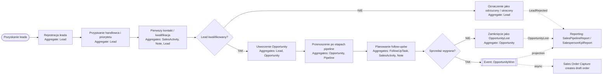

# Proces 1 – Obsługa leada i pipeline sprzedażowego

## Cel

Diagram procesu biznesowego z naniesionymi agregatami, bounded contextami i zdarzeniami.

## Bounded contexty
- `Customer Management`
- `Lead & Pipeline`
- `Sales Activity`
- `Reporting & Analytics`

## Agregaty biorące udział
- `Lead`
- `Opportunity`
- `Pipeline`
- `SalesActivity`
- `FollowUpTask`
- `Note`

## Zdarzenia
- `LeadRejected`
- `OpportunityLost`
- `OpportunityWon`

## Kroki procesu
| Krok | Nazwa | Dodatkowe informacje |
|---|---|---|
| 1 | Pozyskanie leada | type: start |
| 2 | Rejestracja leada | aggregate: Lead |
| 3 | Przypisanie handlowca i priorytetu | aggregate: Lead |
| 4 | Pierwszy kontakt / kwalifikacja | aggregates: SalesActivity, Note, Lead |
| 5 | Lead kwalifikowany? | type: decision |
| 5N | Oznaczenie jako odrzucony / utracony | aggregate: Lead; event: LeadRejected |
| 6 | Utworzenie Opportunity | aggregates: Lead, Opportunity; event: OpportunityCreated |
| 7 | Przenoszenie po etapach pipeline | aggregates: Opportunity, Pipeline |
| 8 | Planowanie follow-upów | aggregates: FollowUpTask, SalesActivity, Note |
| 9 | Sprzedaż wygrana? | type: decision |
| 9N | Zamknięcie jako OpportunityLost | aggregate: Opportunity; event: OpportunityLost |
| 9T | Publikacja zdarzenia OpportunityWon | aggregate: Opportunity; event: OpportunityWon |
| 10 | Przekazanie do procesu zamówienia | consumer: Sales Order Capture |

## Mermaid
