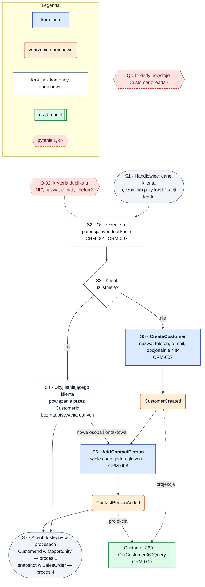

# Proces 2 — Zarządzanie klientem

**Cel:** jedna karta klienta z osobami kontaktowymi, używana przez sprzedaż i zamówienia przez `CustomerId`.
**Konteksty:** Customer Management, Sales Pipeline, Order Capture, Reporting & KPI.
**Agregaty:** `Customer`. **Backlog:** CRM-001, CRM-007, CRM-008, CRM-009.
Wersja maszynowa: [`processes.json`](processes.json) (`process_02_customer_management`).

Oznaczenia: ✔ zaimplementowane, ◐ częściowo, ○ planowane, ❓ do decyzji.

## Kroki

| Krok | Typ | Opis | Kontekst / agregat | Komenda | Zdarzenia | Stan | Story |
|---|---|---|---|---|---|---|---|
| S1 | start | Handlowiec ma dane klienta: wprowadza je ręcznie albo przy kwalifikacji leada (Q-01) | Customer Management | — | — | — | CRM-007 |
| S2 | akcja | System ostrzega o potencjalnym duplikacie (Q-02) | Customer Management / `Customer` | — | — | ○ | CRM-001, CRM-007 |
| S3 | decyzja | Czy klient już istnieje? | — | — | — | — | — |
| S4 | akcja | Użycie istniejącego klienta — powiązanie przez `CustomerId`, bez nadpisywania jego danych | Customer Management | — | — | ○ | CRM-007 |
| S5 | komenda | Utworzenie karty klienta: nazwa, telefon, e-mail, opcjonalnie NIP | Customer Management / `Customer` | `CreateCustomer` | `CustomerCreated` | ○ | CRM-007 |
| S6 | komenda | Dodanie osoby kontaktowej (wiele osób, jedna może być główna) | Customer Management / `Customer` | `AddContactPerson` | `ContactPersonAdded` | ○ | CRM-008 |
| S7 | koniec | Klient dostępny w procesach: `CustomerId` w szansie ([proces 1](process_01_lead_pipeline.md)), snapshot w zamówieniu ([proces 4](process_04_sales_finalization_order_capture.md)) | Customer Management | — | — | — | CRM-009 |

**Read modele:** Customer 360 (`GetCustomer360Query`, CRM-009) ○ — dane klienta, osoby kontaktowe, leady, szanse,
kontakty, notatki i zamówienia, od najnowszych.

## Reguły biznesowe

- Klient musi mieć nazwę; telefon, e-mail i NIP (`TaxIdentifier`) są danymi kontaktowymi klienta.
- Duplikat jest tylko ostrzeżeniem — handlowiec wybiera istniejącego klienta albo świadomie tworzy nowego (Q-02).
- Użycie istniejącego klienta nie nadpisuje jego danych; zmiana danych klienta to osobna decyzja (poza backlogiem MVP).
- Inne konteksty przechowują tylko `CustomerId`; `Order Capture` pobiera snapshot zapytaniem synchronicznym.
- Widoczność klientów innych handlowców — `doc/02` §4.1 (Q-02, Q-13).

**Otwarte pytania:** Q-01, Q-02, Q-13 ([`open_questions.md`](../open_questions.md)).

## Diagram

<!-- diagram: 03_process_02_customer_management -->

Plik PNG: [`diagrams/png/03_process_02_customer_management.png`](../../diagrams/png/03_process_02_customer_management.png).

