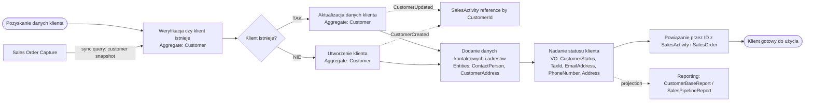

# Proces 2 – Zarządzanie klientem

## Cel

Diagram procesu biznesowego z naniesionymi agregatami, bounded contextami i zdarzeniami.

## Bounded contexty
- `Customer Management`
- `Sales Activity`
- `Sales Order Capture`
- `Reporting & Analytics`

## Agregaty biorące udział
- `Customer`
- `SalesActivity`
- `SalesOrder`

## Encje i Value Objects
- `ContactPerson`
- `CustomerAddress`
- `CustomerStatus`
- `TaxId`
- `EmailAddress`
- `PhoneNumber`
- `Address`

## Zdarzenia
- `CustomerCreated`
- `CustomerUpdated`

## Kroki procesu
| Krok | Nazwa | Dodatkowe informacje |
|---|---|---|
| 1 | Pozyskanie danych klienta | type: start |
| 2 | Weryfikacja czy klient już istnieje | aggregate: Customer |
| 3 | Klient istnieje? | type: decision |
| 3T | Aktualizacja danych klienta | aggregate: Customer; event: CustomerUpdated |
| 3N | Utworzenie klienta | aggregate: Customer; event: CustomerCreated |
| 4 | Dodanie danych kontaktowych i adresów | entities: ContactPerson, CustomerAddress |
| 5 | Nadanie statusu klienta | value_objects: CustomerStatus, TaxId, EmailAddress, PhoneNumber, Address |
| 6 | Powiązanie klienta z aktywnościami / sprzedażą | references_by_id: SalesActivity, SalesOrder |
| 7 | Klient gotowy do użycia w sprzedaży i zamówieniach | type: end |

## Mermaid
