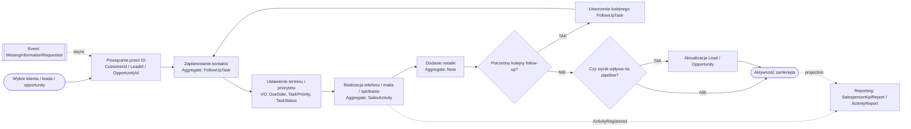

# Proces 3 – Planowanie i rejestracja aktywności handlowca

## Cel

Diagram procesu biznesowego z naniesionymi agregatami, bounded contextami i zdarzeniami.

## Bounded contexty
- `Customer Management`
- `Lead & Pipeline`
- `Sales Activity`
- `Reporting & Analytics`

## Agregaty biorące udział
- `FollowUpTask`
- `SalesActivity`
- `Note`
- `Lead`
- `Opportunity`

## Encje i Value Objects
- `Reminder`
- `DueDate`
- `TaskStatus`
- `TaskPriority`
- `ActivityType`
- `ActivityOutcome`
- `ActivityTimeRange`
- `NoteContent`

## Zdarzenia
- `MissingInformationRequested`
- `ActivityRegistered`

## Kroki procesu
| Krok | Nazwa | Dodatkowe informacje |
|---|---|---|
| 1 | Wybór klienta / leada / opportunity | type: start |
| 2 | Powiązanie przez ID | references_by_id: Customer, Lead, Opportunity |
| 3 | Zaplanowanie kontaktu | aggregate: FollowUpTask |
| 4 | Ustawienie terminu i priorytetu | aggregate: FollowUpTask; value_objects: DueDate, TaskPriority, TaskStatus |
| 5 | Realizacja telefonu / maila / spotkania | aggregate: SalesActivity; value_objects: ActivityType, ActivityTimeRange, ActivityOutcome |
| 6 | Dodanie notatki | aggregate: Note; value_objects: NoteContent |
| 7 | Potrzebny kolejny follow-up? | type: decision |
| 7T | Utworzenie kolejnego FollowUpTask | aggregate: FollowUpTask |
| 8 | Czy wynik wpływa na pipeline? | type: decision |
| 8T | Aktualizacja Lead / Opportunity | aggregates: Lead, Opportunity |
| 9 | Aktywność zamknięta | type: end |

## Mermaid
