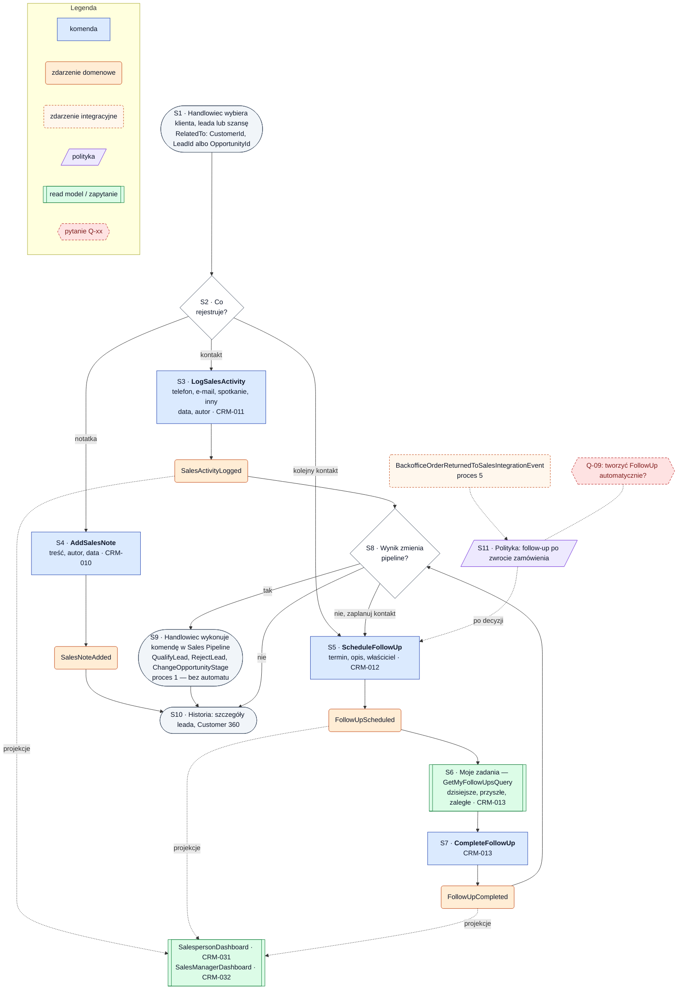

# Proces 3 — Planowanie i rejestracja aktywności handlowca

**Cel:** kontakty, notatki i follow-upy powiązane z klientem, leadem albo szansą; lista zadań handlowca.
**Konteksty:** Sales Activities, Sales Pipeline, Customer Management, Reporting & KPI.
**Agregaty:** `SalesActivity` (typy: kontakt, `SalesNote`, `FollowUp`). **Backlog:** CRM-010–013.
Wersja maszynowa: [`processes.json`](processes.json) (`process_03_sales_activity`).

Oznaczenia: ✔ zaimplementowane, ◐ częściowo, ○ planowane, ❓ do decyzji.

## Kroki

| Krok | Typ | Opis | Kontekst / agregat | Komenda / zapytanie | Zdarzenia | Stan | Story |
|---|---|---|---|---|---|---|---|
| S1 | start | Handlowiec wybiera klienta, leada albo szansę (`RelatedTo`) | Sales Activities | — | — | — | — |
| S2 | decyzja | Co rejestruje: kontakt, notatkę czy kolejny kontakt? | — | — | — | — | — |
| S3 | komenda | Rejestracja kontaktu: typ (telefon, e-mail, spotkanie, inny), data, autor, opcjonalnie notatka | Sales Activities / `SalesActivity` | `LogSalesActivity` | `SalesActivityLogged` | ○ | CRM-011 |
| S4 | komenda | Dodanie notatki: treść, autor, data | Sales Activities / `SalesActivity` | `AddSalesNote` | `SalesNoteAdded` | ○ | CRM-010 |
| S5 | komenda | Zaplanowanie follow-upu: termin, opis, właściciel | Sales Activities / `SalesActivity` | `ScheduleFollowUp` | `FollowUpScheduled` | ○ | CRM-012 |
| S6 | zapytanie | Lista moich zadań: dzisiejsze, przyszłe, zaległe | Sales Activities | `GetMyFollowUpsQuery` | — | ○ | CRM-013 |
| S7 | komenda | Oznaczenie follow-upu jako wykonanego | Sales Activities / `SalesActivity` | `CompleteFollowUp` | `FollowUpCompleted` | ○ | CRM-013 |
| S8 | decyzja | Czy wynik zmienia pipeline? | — | — | — | — | — |
| S9 | akcja | Handlowiec wykonuje komendę w Sales Pipeline ([proces 1](process_01_lead_pipeline.md)) — bez automatycznej zmiany | Sales Pipeline | `QualifyLead`, `RejectLead`, `ChangeOpportunityStage` | — | ◐ | CRM-005, CRM-006, CRM-015 |
| S10 | koniec | Aktywność widoczna w historii leada i w Customer 360 | Sales Activities | — | — | — | CRM-003, CRM-009 |
| S11 | polityka | Po zwrocie zamówienia (`BackofficeOrderReturnedToSalesIntegrationEvent`) follow-up dla handlowca — tylko po decyzji Q-09 | Sales Activities | — | — | ❓ | CRM-026 |

**Read modele:** Moje zadania (`GetMyFollowUpsQuery`, CRM-013) ○; `SalespersonDashboard` (CRM-031) i
`SalesManagerDashboard` (CRM-032) ○; historia w `GetLeadDetailsQuery` (CRM-003) i `GetCustomer360Query` (CRM-009) ○.

## Reguły biznesowe

- Aktywność jest powiązana z dokładnie jednym obiektem: klientem, leadem albo szansą (`RelatedTo`).
- Kontakt ma typ, datę i autora; notatka ma treść, autora i datę; follow-up ma termin i właściciela.
- Follow-up po terminie i niewykonany jest zaległy — widoczny na liście zadań i dashboardzie.
- Notatek nie usuwa się fizycznie; edycja i usuwanie — Q-17.
- Wynik kontaktu nie zmienia pipeline automatycznie.

**Otwarte pytania:** Q-09, Q-16, Q-17 ([`open_questions.md`](../open_questions.md)).

## Diagram

<!-- diagram: 04_process_03_sales_activity -->

Plik PNG: [`diagrams/png/04_process_03_sales_activity.png`](../../diagrams/png/04_process_03_sales_activity.png).

