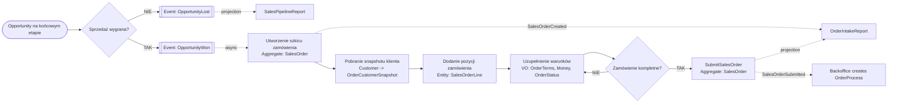

# Proces 4 – Finalizacja sprzedaży i wprowadzanie zamówienia

## Cel

Diagram procesu biznesowego z naniesionymi agregatami, bounded contextami i zdarzeniami.

## Bounded contexty
- `Customer Management`
- `Lead & Pipeline`
- `Sales Order Capture`
- `Backoffice Order Processing`
- `Reporting & Analytics`

## Agregaty biorące udział
- `Opportunity`
- `Customer`
- `SalesOrder`

## Encje i Value Objects
- `SalesOrderLine`
- `OrderTerms`
- `OrderCustomerSnapshot`
- `OrderStatus`
- `Money`

## Zdarzenia
- `OpportunityWon`
- `OpportunityLost`
- `SalesOrderCreated`
- `SalesOrderSubmitted`

## Kroki procesu
| Krok | Nazwa | Dodatkowe informacje |
|---|---|---|
| 1 | Opportunity na końcowym etapie | aggregate: Opportunity; type: start |
| 2 | Sprzedaż wygrana? | aggregate: Opportunity; type: decision |
| 2N | Publikacja OpportunityLost | event: OpportunityLost |
| 3 | Publikacja OpportunityWon | aggregate: Opportunity; event: OpportunityWon |
| 4 | Utworzenie szkicu zamówienia | aggregate: SalesOrder; event: SalesOrderCreated |
| 5 | Pobranie snapshotu klienta | aggregates: Customer, SalesOrder; communication: sync query |
| 6 | Dodanie pozycji zamówienia | aggregate: SalesOrder; entity: SalesOrderLine |
| 7 | Uzupełnienie warunków zamówienia | aggregate: SalesOrder; value_objects: OrderTerms, Money, OrderStatus, OrderCustomerSnapshot |
| 8 | Zamówienie kompletne? | aggregate: SalesOrder; type: decision |
| 8N | Powrót do uzupełnienia danych |  |
| 9 | Przekazanie kompletnego zamówienia | aggregate: SalesOrder; command: SubmitSalesOrder |
| 10 | Publikacja SalesOrderSubmitted | event: SalesOrderSubmitted |
| 11 | Backoffice rozpoczyna obsługę | consumer: Backoffice Order Processing |

## Mermaid
