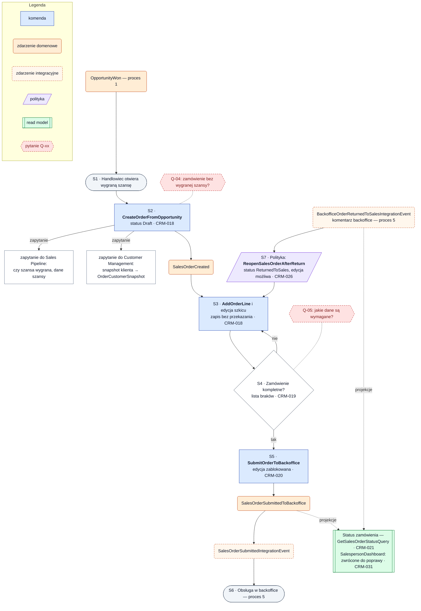

# Proces 4 — Finalizacja sprzedaży i wprowadzanie zamówienia

**Cel:** zamówienie handlowca od wygranej szansy do przekazania do backoffice, z pętlą poprawek po zwrocie.
**Konteksty:** Order Capture, Sales Pipeline, Customer Management, Order Backoffice, Reporting & KPI.
**Agregaty:** `SalesOrder`. **Backlog:** CRM-016, CRM-018–021, CRM-026.
Wersja maszynowa: [`processes.json`](processes.json) (`process_04_sales_finalization_order_capture`).
Statusy: [`order_status_lifecycle.md`](../order_status_lifecycle.md) (diagram 08).

Oznaczenia: ✔ zaimplementowane, ◐ częściowo, ○ planowane, ❓ do decyzji.

## Kroki

| Krok | Typ | Opis | Kontekst / agregat | Komenda | Zdarzenia | Stan | Story |
|---|---|---|---|---|---|---|---|
| S1 | start | Szansa jest wygrana (`OpportunityWon`, [proces 1](process_01_lead_pipeline.md)); handlowiec otwiera ją | Sales Pipeline | — | — | — | CRM-016 |
| S2 | komenda | Utworzenie zamówienia w statusie `Draft`; handler sprawdza zapytaniem, czy szansa jest wygrana (Q-04), i pobiera snapshot klienta | Order Capture / `SalesOrder` | `CreateOrderFromOpportunity` | `SalesOrderCreated` | ○ | CRM-018 |
| S3 | komenda | Edycja szkicu: pozycje i warunki; zapis bez przekazania | Order Capture / `SalesOrder` | `AddOrderLine` | — | ○ | CRM-018, CRM-019 |
| S4 | decyzja | Czy zamówienie jest kompletne? Lista braków widoczna przed przekazaniem (Q-05) | Order Capture / `SalesOrder` | — | — | — | CRM-019 |
| S5 | komenda | Przekazanie do backoffice; edycja zablokowana; publikacja `SalesOrderSubmittedIntegrationEvent` | Order Capture / `SalesOrder` | `SubmitOrderToBackoffice` | `SalesOrderSubmittedToBackoffice` | ○ | CRM-020 |
| S6 | koniec | Zamówienie w obsłudze backoffice ([proces 5](process_05_backoffice_order_processing.md)) | Order Backoffice | — | — | — | CRM-022 |
| S7 | polityka | Po `BackofficeOrderReturnedToSalesIntegrationEvent` zamówienie przechodzi w `ReturnedToSales` i znów jest edytowalne | Order Capture / `SalesOrder` | `ReopenSalesOrderAfterReturn` | — | ○ | CRM-026 |

Wywołania synchroniczne w S2: `Sales Pipeline` (czy szansa jest wygrana, dane szansy) i `Customer Management`
(snapshot klienta → `OrderCustomerSnapshot`).

**Read modele:** Status zamówienia (`GetSalesOrderStatusQuery`, CRM-021) ○; `SalespersonDashboard` — zamówienia
zwrócone do poprawy (CRM-031) ○.

## Reguły biznesowe

- Zamówienie tworzy handlowiec z wygranej szansy — nie powstaje automatycznie po `OpportunityWon` (CRM-016, CRM-018, Q-04).
- Zamówienie jest powiązane z klientem i szansą; dane klienta są wstępnie uzupełnione ze snapshotu.
- Szkic można zapisać bez przekazania do backoffice.
- Niekompletnego zamówienia nie można przekazać; komunikaty walidacji są zrozumiałe biznesowo (CRM-019, Q-05).
- Po przekazaniu handlowiec nie może dowolnie edytować zamówienia; edycja wraca tylko po zwrocie z backoffice.
- Ponowne przekazanie po poprawie wznawia obsługę w backoffice (Q-08).

**Otwarte pytania:** Q-04, Q-05, Q-07, Q-08 ([`open_questions.md`](../open_questions.md)).

## Diagram

<!-- diagram: 05_process_04_sales_finalization_order_capture -->

Plik PNG: [`diagrams/png/05_process_04_sales_finalization_order_capture.png`](../../diagrams/png/05_process_04_sales_finalization_order_capture.png).

