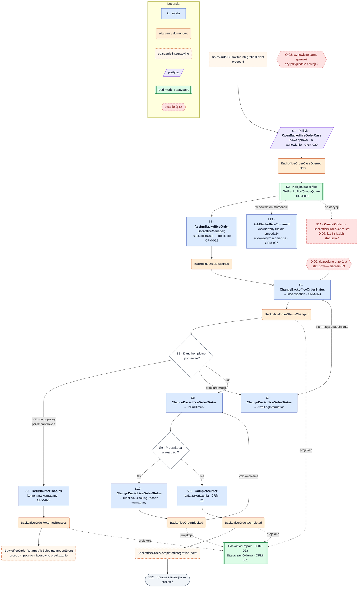

# Proces 5 — Obsługa zamówienia przez backoffice

**Cel:** od przekazanego zamówienia do zamkniętej sprawy backoffice — z kolejką, przydziałem, weryfikacją,
zwrotem do handlowca, blokadą i zakończeniem.
**Konteksty:** Order Backoffice, Order Capture, Sales Activities, Integrations, Reporting & KPI.
**Agregaty:** `BackofficeOrderCase`. **Backlog:** CRM-020, CRM-022–027.
Wersja maszynowa: [`processes.json`](processes.json) (`process_05_backoffice_order_processing`).
Statusy i dozwolone przejścia: [`order_status_lifecycle.md`](../order_status_lifecycle.md) (diagram 09, Q-06).

Oznaczenia: ✔ zaimplementowane, ◐ częściowo, ○ planowane, ❓ do decyzji.

## Kroki

| Krok | Typ | Opis | Kontekst / agregat | Komenda / zapytanie | Zdarzenia | Stan | Story |
|---|---|---|---|---|---|---|---|
| S1 | polityka | Po `SalesOrderSubmittedIntegrationEvent` otwórz sprawę (`New`) albo wznów istniejącą po ponownym przekazaniu (Q-08) | Order Backoffice / `BackofficeOrderCase` | `OpenBackofficeOrderCase` | `BackofficeOrderCaseOpened` | ○ | CRM-020, CRM-022 |
| S2 | zapytanie | Kolejka backoffice: klient, handlowiec, data przekazania, status; filtrowanie i sortowanie | Order Backoffice | `GetBackofficeQueueQuery` | — | ○ | CRM-022 |
| S3 | komenda | Przypisanie pracownika (menedżer) albo przypisanie do siebie (pracownik) | Order Backoffice / `BackofficeOrderCase` | `AssignBackofficeOrder` | `BackofficeOrderAssigned` | ○ | CRM-023 |
| S4 | komenda | Rozpoczęcie weryfikacji: `InVerification` | Order Backoffice / `BackofficeOrderCase` | `ChangeBackofficeOrderStatus` | `BackofficeOrderStatusChanged` | ○ | CRM-024 |
| S5 | decyzja | Czy dane są kompletne i poprawne? | — | — | — | — | — |
| S6 | komenda | Zwrot do handlowca z komentarzem; publikacja `BackofficeOrderReturnedToSalesIntegrationEvent` ([proces 4](process_04_sales_finalization_order_capture.md)) | Order Backoffice / `BackofficeOrderCase` | `ReturnOrderToSales` | `BackofficeOrderReturnedToSales` | ○ | CRM-026 |
| S7 | komenda | Oczekiwanie na informacje bez zwrotu do handlowca: `AwaitingInformation` | Order Backoffice / `BackofficeOrderCase` | `ChangeBackofficeOrderStatus` | `BackofficeOrderStatusChanged` | ○ | CRM-024 |
| S8 | komenda | Realizacja: `InFulfillment` | Order Backoffice / `BackofficeOrderCase` | `ChangeBackofficeOrderStatus` | `BackofficeOrderStatusChanged` | ○ | CRM-024 |
| S9 | decyzja | Czy jest przeszkoda w realizacji? | — | — | — | — | — |
| S10 | komenda | Zablokowanie z powodem (`BlockingReason`); po usunięciu przeszkody powrót do realizacji | Order Backoffice / `BackofficeOrderCase` | `ChangeBackofficeOrderStatus` | `BackofficeOrderBlocked` | ○ | CRM-024 |
| S11 | komenda | Zakończenie: `Completed` z datą zakończenia; publikacja `BackofficeOrderCompletedIntegrationEvent` | Order Backoffice / `BackofficeOrderCase` | `CompleteOrder` | `BackofficeOrderCompleted` | ○ | CRM-027 |
| S12 | koniec | Sprawa zamknięta; dalej [proces 6](process_06_integration_invoice_payment_reporting.md) | Order Backoffice | — | — | — | CRM-027 |
| S13 | komenda | Komentarz wewnętrzny albo widoczny dla sprzedaży — w dowolnym momencie obsługi | Order Backoffice / `BackofficeOrderCase` | `AddBackofficeComment` | `BackofficeCommentAdded` | ○ | CRM-025 |
| S14 | komenda | Anulowanie zamówienia i publikacja `BackofficeOrderCancelledIntegrationEvent` — kto i z jakich statusów, do decyzji | Order Backoffice / `BackofficeOrderCase` | `CancelOrder` | `BackofficeOrderCancelled` | ❓ | — |

**Read modele:** Kolejka backoffice (`GetBackofficeQueueQuery`, CRM-022) ○; `BackofficeReport` (CRM-033) ○;
Status zamówienia dla handlowca (`GetSalesOrderStatusQuery`, CRM-021) ○.

## Reguły biznesowe

- Przejścia statusów tylko zgodnie z dozwolonym workflow (Q-06); każda zmiana statusu i przypisania trafia do historii.
- Zablokowanie wymaga powodu; zwrot do handlowca wymaga komentarza; zakończenie zapisuje datę zakończenia.
- Komentarze mają autora i datę, mogą być wewnętrzne albo widoczne dla sprzedaży i nie znikają po zmianie statusu.
- Backoffice nie zmienia danych `SalesOrder` ani pipeline — zwraca zamówienie, a poprawkę wykonuje handlowiec.
- Przypisanie pracownikowi: `BackofficeManager`; `BackofficeUser` może przypisać zamówienie do siebie (`doc/02`).

**Otwarte pytania:** Q-06, Q-07, Q-08, Q-09, Q-14 ([`open_questions.md`](../open_questions.md)).

## Diagram

<!-- diagram: 06_process_05_backoffice_order_processing -->

Plik PNG: [`diagrams/png/06_process_05_backoffice_order_processing.png`](../../diagrams/png/06_process_05_backoffice_order_processing.png).

