# Proces 5 – Obsługa zamówienia przez backoffice

## Cel

Diagram procesu biznesowego z naniesionymi agregatami, bounded contextami i zdarzeniami.

## Bounded contexty
- `Sales Order Capture`
- `Backoffice Order Processing`
- `Sales Activity`
- `Integration Context`
- `Reporting & Analytics`

## Agregaty biorące udział
- `SalesOrder`
- `OrderProcess`
- `BackofficeTask`
- `FollowUpTask`

## Encje i Value Objects
- `OrderClarification`
- `StatusHistoryEntry`
- `FulfillmentRequest`
- `ProcessStatus`
- `FulfillmentData`
- `TaskType`
- `TaskStatus`
- `DueDate`

## Zdarzenia
- `SalesOrderSubmitted`
- `MissingInformationRequested`
- `MissingInformationProvided`
- `OrderAcceptedForFulfillment`
- `OrderCompleted`

## Kroki procesu
| Krok | Nazwa | Dodatkowe informacje |
|---|---|---|
| 1 | Otrzymanie zdarzenia SalesOrderSubmitted | event: SalesOrderSubmitted; type: start |
| 2 | Utworzenie procesu obsługi | aggregate: OrderProcess |
| 3 | Przypisanie do pracownika backoffice | aggregates: OrderProcess, BackofficeTask |
| 4 | Weryfikacja kompletności zamówienia | aggregate: OrderProcess |
| 5 | Braki w zamówieniu? | type: decision |
| 5T | Utworzenie wyjaśnienia / prośby o dane | entity: OrderClarification; event: MissingInformationRequested |
| 5T2 | Utworzenie zadania follow-up | aggregate: FollowUpTask |
| 5T3 | Otrzymanie MissingInformationProvided | event: MissingInformationProvided |
| 6 | Akceptacja do realizacji | aggregate: OrderProcess |
| 7 | Utworzenie zlecenia operacyjnego | aggregates: OrderProcess, BackofficeTask; entity: FulfillmentRequest |
| 8 | Publikacja OrderAcceptedForFulfillment | event: OrderAcceptedForFulfillment |
| 9 | Monitorowanie realizacji i aktualizacja statusu | aggregates: OrderProcess, StatusHistoryEntry |
| 10 | Realizacja zakończona? | type: decision |
| 11 | Zamknięcie procesu | event: OrderCompleted |

## Mermaid

```mermaid
flowchart LR
  Start[[Event: SalesOrderSubmitted]] -. async .-> CreateProcess[Utworzenie procesu obsługi\nAggregate: OrderProcess]
  CreateProcess --> Assign[Przypisanie pracownika backoffice\nAggregates: OrderProcess, BackofficeTask]
  Assign --> Verify[Weryfikacja kompletności\nAggregate: OrderProcess]
  Verify --> Missing{Braki w zamówieniu?}
  Missing -- TAK --> Clarification[Utworzenie prośby o dane\nEntity: OrderClarification]
  Clarification -. MissingInformationRequested .-> FollowUp[Sales Activity creates FollowUpTask]
  FollowUp -. MissingInformationProvided .-> Verify
  Missing -- NIE --> Accept[Akceptacja do realizacji\nAggregate: OrderProcess]
  Accept --> Fulfillment[Utworzenie zlecenia operacyjnego\nEntity: FulfillmentRequest]
  Fulfillment -. OrderAcceptedForFulfillment .-> Integration[Integration Context]
  Fulfillment --> Monitor[Monitorowanie realizacji i statusu\nEntity: StatusHistoryEntry]
  Monitor --> Done{Realizacja zakończona?}
  Done -- NIE --> Monitor
  Done -- TAK --> Complete[Zamknięcie procesu]
  Complete -. OrderCompleted .-> Reports[Reporting: OrderProcessingReport / RevenueReport]

```
