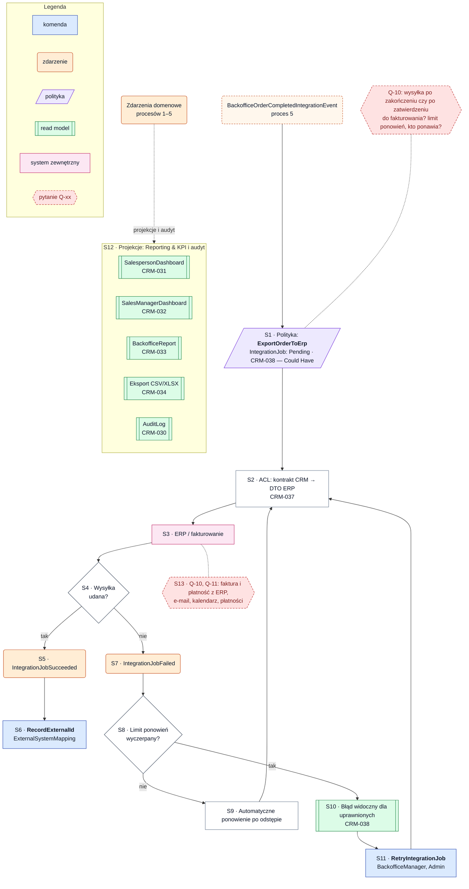

# Proces 6 — Integracja, fakturowanie, płatność i aktualizacja raportów

**Cel:** przekazanie zrealizowanego zamówienia do ERP/fakturowania przez warstwę antykorupcyjną oraz aktualizacja
raportów i audytu ze zdarzeń.
**Konteksty:** Integrations, Order Backoffice, Reporting & KPI, Identity & Access (audyt).
**Agregaty:** `IntegrationJob`, `ExternalSystemMapping`. **Backlog:** CRM-030–034, CRM-037, CRM-038.
Wersja maszynowa: [`processes.json`](processes.json) (`process_06_integration_invoice_payment_reporting`).

Integracja ERP/fakturowania ma priorytet **Could Have**. Informacje zwrotne o fakturze i płatności oraz integracje
e-mail, kalendarza i płatności nie są częścią modelu do czasu decyzji (Q-10, Q-11).

Oznaczenia: ✔ zaimplementowane, ◐ częściowo, ○ planowane, ❓ do decyzji.

## Kroki

| Krok | Typ | Opis | Kontekst / agregat | Komenda | Zdarzenia | Stan | Story |
|---|---|---|---|---|---|---|---|
| S1 | polityka | Po `BackofficeOrderCompletedIntegrationEvent` utwórz zadanie eksportu (`Pending`) — moment wysyłki do potwierdzenia (Q-10) | Integrations / `IntegrationJob` | `ExportOrderToErp` | — | ○ | CRM-038 |
| S2 | akcja | ACL: mapowanie kontraktu CRM na DTO systemu zewnętrznego | Integrations | — | — | ○ | CRM-037 |
| S3 | zewnętrzny | Wywołanie API ERP / fakturowania | Integrations | — | — | ○ | CRM-038 |
| S4 | decyzja | Czy wysyłka się udała? | — | — | — | — | — |
| S5 | akcja | Zadanie zakończone sukcesem | Integrations / `IntegrationJob` | — | `IntegrationJobSucceeded` | ○ | CRM-038 |
| S6 | komenda | Zapis identyfikatora zamówienia w systemie zewnętrznym | Integrations / `ExternalSystemMapping` | `RecordExternalId` | — | ○ | CRM-038 |
| S7 | akcja | Zapis nieudanej próby (bez danych wrażliwych) | Integrations / `IntegrationJob` | — | `IntegrationJobFailed` | ○ | CRM-038 |
| S8 | decyzja | Czy limit automatycznych ponowień został wyczerpany? (Q-10) | — | — | — | — | — |
| S9 | akcja | Automatyczne ponowienie po odstępie | Integrations / `IntegrationJob` | — | — | ○ | CRM-038 |
| S10 | akcja | Błąd integracji widoczny dla uprawnionych użytkowników | Integrations | — | — | ○ | CRM-038 |
| S11 | komenda | Ręczne ponowienie wysyłki | Integrations / `IntegrationJob` | `RetryIntegrationJob` | — | ○ | CRM-038 |
| S12 | polityka | Projekcje raportowe i audyt ze zdarzeń wszystkich kontekstów (T-02, T-05, T-06) | Reporting & KPI | — | — | ○ | CRM-030–034 |
| S13 | polityka | Informacje zwrotne z ERP (faktura, płatność), e-mail, kalendarz, płatności — do decyzji | Integrations | — | — | ❓ | — |

**Read modele:** `SalespersonDashboard` (CRM-031), `SalesManagerDashboard` (CRM-032), `BackofficeReport` (CRM-033),
eksport CSV/XLSX (`ReportExport`, CRM-034), `AuditLog` (CRM-030) — wszystkie ○. Zasilanie:
[`events_catalog.md`](../events_catalog.md#zasilanie-read-modeli).

## Reguły biznesowe

- Integracja działa wyłącznie przez warstwę antykorupcyjną; DTO systemów zewnętrznych nie trafiają do domeny.
- System zapisuje status każdej wysyłki; błąd jest widoczny dla uprawnionych i można ponowić wysyłkę (CRM-038).
- Automatyczne ponowienia mają limit — nie ma nieskończonej pętli; po limicie wymagana jest decyzja człowieka.
- Raporty i audyt nie wywołują komend; aktualizują się wyłącznie ze zdarzeń.
- Wpis audytu zawiera użytkownika, czas, akcję i identyfikator obiektu (CRM-030).

**Otwarte pytania:** Q-10, Q-11, Q-15 ([`open_questions.md`](../open_questions.md)).

## Diagram

<!-- diagram: 07_process_06_integration_invoice_payment_reporting -->

Plik PNG: [`diagrams/png/07_process_06_integration_invoice_payment_reporting.png`](../../diagrams/png/07_process_06_integration_invoice_payment_reporting.png).

