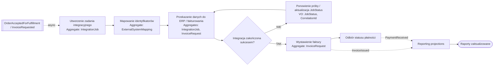

# Proces 6 – Integracja, fakturowanie, płatność i aktualizacja raportów

## Cel

Diagram procesu biznesowego z naniesionymi agregatami, bounded contextami i zdarzeniami.

## Bounded contexty
- `Backoffice Order Processing`
- `Integration Context`
- `Reporting & Analytics`

## Agregaty biorące udział
- `IntegrationJob`
- `ExternalSystemMapping`
- `InvoiceRequest`

## Encje i Value Objects
- `JobAttempt`
- `ExternalSystemName`
- `JobStatus`
- `CorrelationId`
- `ExternalId`
- `InternalId`
- `InvoiceData`
- `BillingAddress`

## Zdarzenia
- `OrderAcceptedForFulfillment`
- `InvoiceRequested`
- `InvoiceIssued`
- `PaymentReceived`

## Kroki procesu
| Krok | Nazwa | Dodatkowe informacje |
|---|---|---|
| 1 | OrderAcceptedForFulfillment / InvoiceRequested | events: OrderAcceptedForFulfillment, InvoiceRequested; type: start |
| 2 | Utworzenie zadania integracyjnego | aggregate: IntegrationJob; entity: JobAttempt |
| 3 | Mapowanie identyfikatorów | aggregate: ExternalSystemMapping; value_objects: ExternalId, InternalId |
| 4 | Przekazanie danych do ERP / fakturowania | aggregates: IntegrationJob, InvoiceRequest |
| 5 | Czy integracja zakończona sukcesem? | type: decision |
| 5N | Ponowienie próby / aktualizacja JobStatus | aggregate: IntegrationJob; value_objects: JobStatus, CorrelationId |
| 6 | Wystawienie faktury | aggregate: InvoiceRequest; value_objects: InvoiceData, BillingAddress |
| 7 | Publikacja InvoiceIssued | event: InvoiceIssued |
| 8 | Odbiór statusu płatności | event: PaymentReceived |
| 9 | Aktualizacja projekcji raportowych | read_models: RevenueReport, OrderProcessingReport, SalespersonKpiReport |
| 10 | Raporty zaktualizowane | type: end |

## Mermaid
