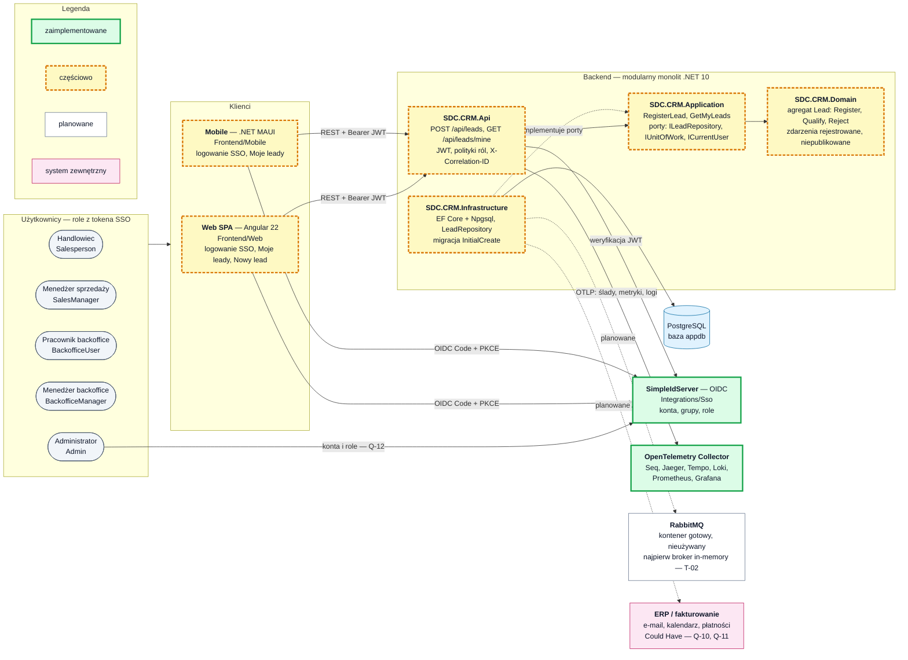

# Kontekst systemu i stan implementacji

Stan na 2026-09-26 (gałąź `main` po PR #4). Oznaczenia: ✔ zaimplementowane, ◐ częściowo, ○ planowane (backlog),
❓ do decyzji (`open_questions.md`).

## Architektura — stan obecny

<!-- diagram: 00_system_context -->

Plik PNG: [`diagrams/png/00_system_context.png`](../diagrams/png/00_system_context.png).

## Komponenty

| Komponent | Lokalizacja | Stan | Opis |
|---|---|---|---|
| Web SPA | `Frontend/Web` | ◐ | Angular 22 (standalone, signals). OIDC przez `angular-oauth2-oidc`, tokeny w `sessionStorage`. Trasy: `/leads` (Moje leady), `/leads/new` (Nowy lead), `/forbidden`; strażnik ról. |
| Mobile | `Frontend/Mobile` | ◐ | .NET MAUI (Android, Windows), MVVM (CommunityToolkit.Mvvm), logika w `SDC.CRM.Mobile.Core`. Logowanie OIDC w przeglądarce systemowej, tokeny w `SecureStorage`, lista moich leadów, komunikat offline. Klient API ma `RegisterLeadAsync`, ale nie ma jeszcze ekranu rejestracji. |
| API | `Backend/src/SDC.CRM.Api` | ◐ | Kontroler `LeadsController`; uwierzytelnianie JWT, polityki `CrmPolicies`, `CurrentUser`, `DomainExceptionMiddleware` (400 `ProblemDetails`), `CorrelationIdMiddleware`, OpenTelemetry, OpenAPI w Development. |
| Application | `Backend/src/SDC.CRM.Application` | ◐ | `RegisterLeadHandler`, `GetMyLeadsHandler`, porty `ILeadRepository`, `IUnitOfWork`, `ICurrentUser`. |
| Domain | `Backend/src/SDC.CRM.Domain` | ◐ | Agregat `Lead`, VO `Email`, zdarzenia `LeadRegistered`, `LeadQualified`, `LeadRejected`, baza `Entity` z listą zdarzeń. |
| Infrastructure | `Backend/src/SDC.CRM.Infrastructure` | ◐ | `CrmDbContext`, `LeadRepository`, `UnitOfWork`, migracja `InitialCreate` (schemat stosowany jawnie, nigdy przy starcie). |
| Testy | `Backend/tests`, `Frontend/Web/src/**/*.spec.ts`, `Frontend/Mobile/tests` | ◐ | TUnit + NSubstitute (domena, aplikacja, API, testy integracyjne HTTP na TestServer), Karma + Jasmine (web), TUnit (mobile). CI: `.github/workflows/{backend,web,mobile}.yml`. |
| PostgreSQL | `docker-compose.yml` (`postgres`) | ✔ | Baza `appdb`. |
| SSO | `Integrations/Sso` | ✔ | SimpleIdServer 6.0.4: klienci `sdc-crm-web` i `sdc-crm-mobile` (publiczni, PKCE), zasób `sdc-crm-api`, role CRM, użytkownicy testowi. |
| Obserwowalność | `infra/`, `docker-compose.yml` | ✔ | OTLP → OpenTelemetry Collector → Seq, Jaeger, Tempo, Loki, Prometheus, Grafana. |
| Broker komunikatów | `docker-compose.yml` (`rabbitmq`) | ○ | Kontener dostępny, aplikacja go nie używa (T-02). |
| ERP, fakturowanie, e-mail, kalendarz, płatności | — | ○ / ❓ | CRM-037, CRM-038 (Could Have), Q-10, Q-11. |

## Stan realizacji backlogu

Story nieujęte w tabeli mają status `Backlog` (`doc/03-backlog-user-stories.md`).

| Story | Status w backlogu | Backend | Web | Mobile | Czego brakuje |
|---|---|---|---|---|---|
| CRM-001 Rejestracja leada | In Progress | ✔ `POST /api/leads` → `RegisterLead`, właściciel z tokena | ✔ `/leads/new` | ◐ tylko klient API | temat/nazwa leada, priorytet, reguła „telefon albo e-mail” (kod wymaga e-maila), ostrzeżenie o duplikacie — Q-02, Q-03 |
| CRM-002 Lista moich leadów | In Progress | ✔ `GET /api/leads/mine` → `GetMyLeadsQuery` | ✔ `/leads` | ✔ ekran główny | priorytet i temat na liście, filtrowanie po statusie, sortowanie, przejście do szczegółów (CRM-003) |
| CRM-005 Kwalifikacja leada | Backlog | ◐ `Lead.Qualify()` w domenie | — | — | komenda i endpoint `QualifyLead`, utworzenie szansy (`CreateOpportunityFromLead`) |
| CRM-006 Odrzucenie leada | Backlog | ◐ `Lead.Reject(reason)` w domenie | — | — | komenda i endpoint `RejectLead`, widoczność powodu w historii |
| CRM-028 Logowanie użytkownika | Review | ✔ walidacja JWT, 401 bez tokena | ✔ OIDC Code + PKCE | ✔ OIDC w przeglądarce systemowej | — |
| CRM-029 Uprawnienia według ról | In Progress | ◐ polityki `leads:register`, `leads:view-own` | ◐ strażnik ról tras | ◐ obsługa 403 | polityki dla kolejnych funkcji (per macierz `doc/02` §3) |

## Zachowania już zaimplementowane (wycinek `Lead`)

- `POST /api/leads` — polityka `leads:register` (`Salesperson`, `SalesManager`, `Admin`); odpowiedź `201` z `id`;
  właściciel = `ICurrentUser.Id` (UUID wyliczony z `sub` tokena), nigdy z treści żądania; naruszenie reguły → `400 ProblemDetails`.
- `GET /api/leads/mine` — polityka `leads:view-own`; zwraca `LeadSummaryDto` (`Id`, `CompanyName`, `ContactName`,
  `ContactEmail`, `Status`, `CreatedAtUtc`).
- Reguły agregatu `Lead`: wymagane nazwa firmy, osoba kontaktowa, poprawny e-mail i właściciel; odrzuconego leada nie można
  zakwalifikować; odrzucenie wymaga powodu; ponowna kwalifikacja jest idempotentna.
- Statusy leada: `New`, `Qualified`, `Rejected` (etykiety w UI: Nowy, Zakwalifikowany, Odrzucony).
- Zdarzenia `LeadRegistered`, `LeadQualified`, `LeadRejected` są rejestrowane w agregacie, ale nie są publikowane (T-02).

